


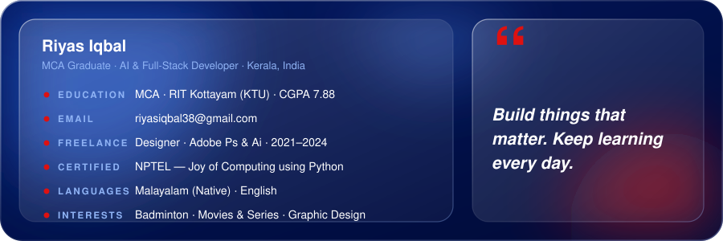

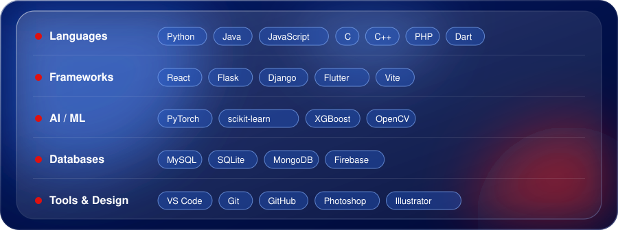
 

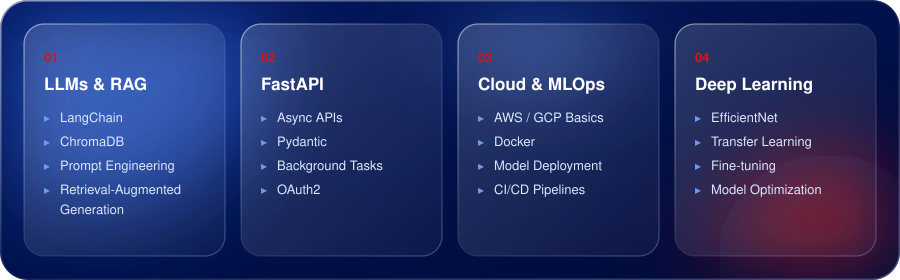

<table>
<tr>
<td width="50%"><a href="https://github.com/Riyas251Iqbal">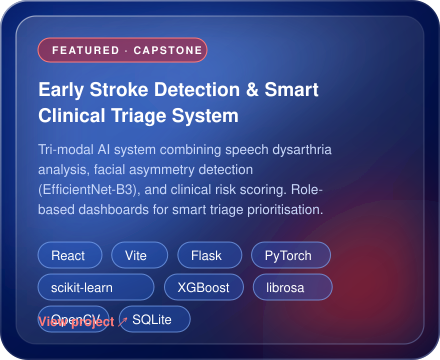</a></td>
<td width="50%"><a href="https://github.com/Riyas251Iqbal">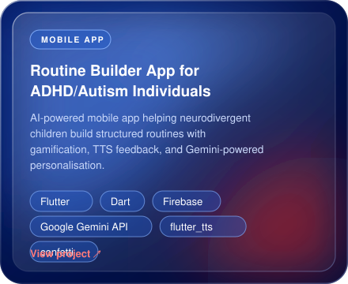</a></td>
</tr>
<tr>
<td width="50%"><a href="https://github.com/Riyas251Iqbal">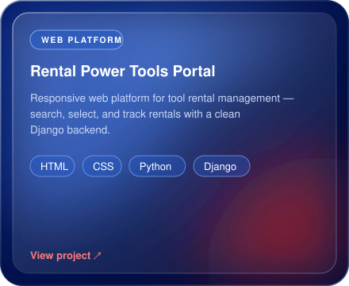</a></td>
<td width="50%"><a href="https://github.com/Riyas251Iqbal">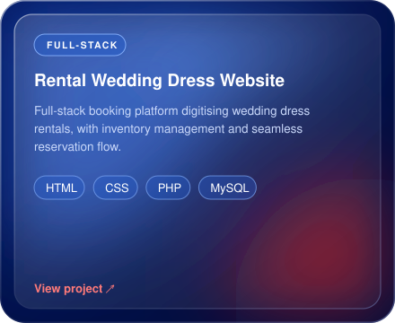</a></td>
</tr>
</table>

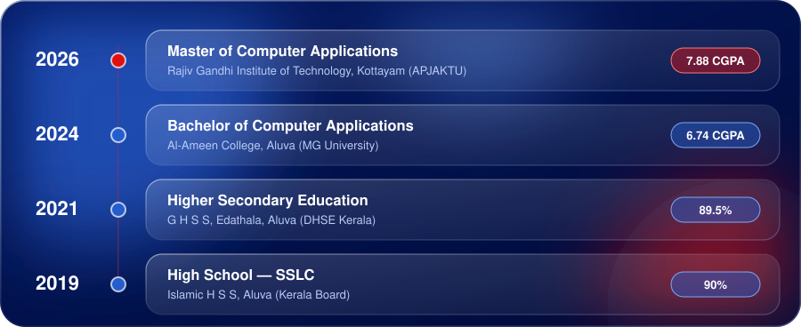
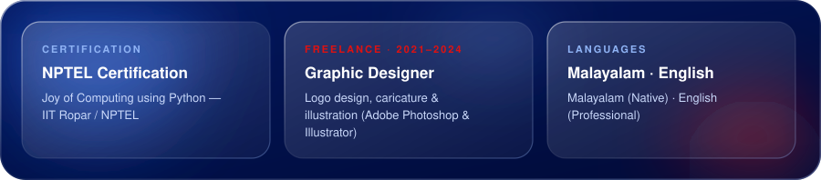


&nbsp;

